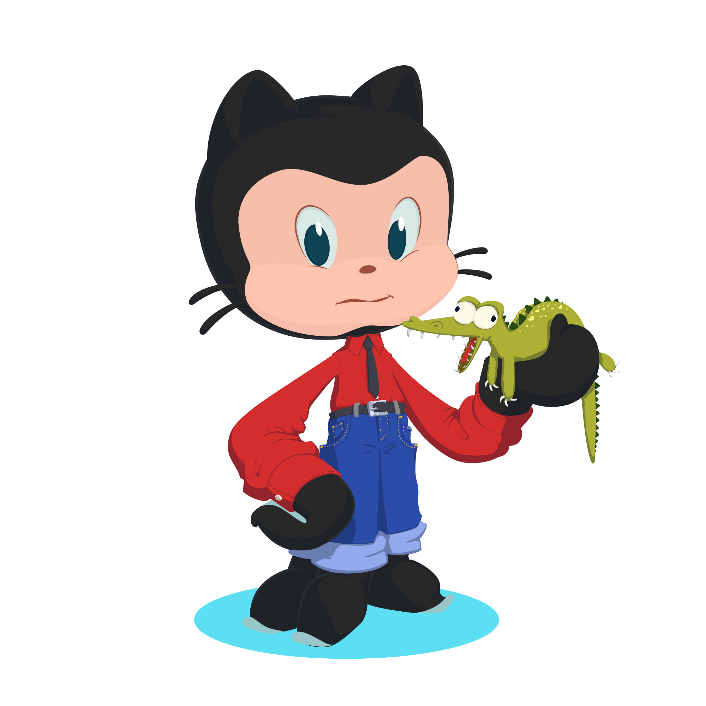

# What is this repository for?

<table>
<tr>
<td>
  This is a playground to try out different things that could make readme's easier to read, more informative, or just more fun. You can use different bits and pieces for project readme's or your personal github readme. 
</td>
</tr>
</table>

## Create your profile README on Github

GitHub will display your profile README on your profile page if the following is true:

- You have created a repository with a name that matches your GitHub username.
- The repository is public.
- The repository contains a file named README.md in its root.
- The ```README.md``` file contains any content.

## Roadmap

- [x] Add a roadmap to the readme
- [ ] add a logo
- [ ] add an Octocat
- [ ] Github stats 
    - [ ] commits etc
    - [ ] coding languages

See the [open issues](https://github.com/amrei-bp/readme_playground/issues) for a full list of proposed features (and known issues).

---

## 😎 Emojis

You can use emojis in the readme to clarify points (and even add them to commits, as I have just learned, use cases are to be determined). 

- ⏱ You can point out deadlines

- [📙](https://www.webfx.com/tools/emoji-cheat-sheet/) Link to documentation

- ✏ Or invite them to contribute

Here is a [cheat-sheet](https://www.webfx.com/tools/emoji-cheat-sheet/).

---

## Top contributors:

You can even add the top contributors of your repo to the readme: 

```{.html}
<a href="https://github.com/amrei-bp/readme_playground/graphs/contributors">
  
</a>
```

<a href="https://github.com/amrei-bp/readme_playground/graphs/contributors">
  
</a>

---


## License

Make it easy for others to know what they can do with your code and add license information into your readme. Often these are placed at the top of the readme for even easier accessibility. They link to the text of the license (not in your repository, but on the web). 

```{.md}
[](https://opensource.org/licenses/MIT)
```

[](https://opensource.org/licenses/MIT)

Here are some [markdown license badges](https://gist.github.com/lukas-h/2a5d00690736b4c3a7ba) you can use.

---

## Readme editor

Here is an [editor](https://readme.so/editor) that can help you write a markdown readme for your project. Click on the different potential content and it will build a markdown file for you. You can edit on the fly and it'll even show a rendered preview for you. In the end, you can copy the raw code to your project's readme file. 

## Title banner

These you can use for projects, but also for your very own user readme. Easily generated [here](https://leviarista.github.io/github-profile-header-generator/). 


---

## Octocat

You can [design your very own octocat](https://myoctocat.com/), or [choose an existing one](https://octodex.github.com/),  and display it in your readme: 



---

## Skill icons

Advertise your skills by listing [skill icons](https://github.com/tandpfun/skill-icons):

```{.html}
<p align="center">
  <a href="https://skillicons.dev">
    
  </a>
</p>
```

<p align="center">
  <a href="https://skillicons.dev">
    
  </a>
</p>

also in light mode:

```{.html}
<p align="center">
  <a href="https://skillicons.dev">
    
  </a>
</p>
```

<p align="center">
  <a href="https://skillicons.dev">
    
  </a>
</p>

[Here](https://github.com/LelouchFR/skill-icons) is another set of skill icons, based on the above, but with more icons, and more activity for adding new icons. 

```{.html}
<p align="center">
  <a href="https://go-skill-icons.vercel.app/">
    
  </a>
</p>
```

<p align="center">
  <a href="https://go-skill-icons.vercel.app/">
    
  </a>
</p>

And below you can find a way to have the icons autmatically toggle between light and dark setting, depending on the system setting: 

```{.html}
<div align="center">
  
  <!-- Dark Mode -->
  [](https://github.com/LelouchFR/skill-icons#gh-dark-mode-only)
  <!-- Light Mode -->
  [](https://github.com/LelouchFR/skill-icons#gh-light-mode-only)

</div>
```

<div align="center">
  
  <!-- Dark Mode -->
  [](https://github.com/LelouchFR/skill-icons#gh-dark-mode-only)
  <!-- Light Mode -->
  [](https://github.com/LelouchFR/skill-icons#gh-light-mode-only)

</div>

## WidgetBox

[WidgetBox](https://github.com/Jurredr/github-widgetbox?tab=readme-ov-file)

[](https://github.com/Jurredr/github-widgetbox)

[](https://github.com/Jurredr/github-widgetbox)
[](https://github.com/Jurredr/github-widgetbox)
[](https://github.com/Jurredr/github-widgetbox)


---

## Github summary cards

There are several different ways to display your github stats (if you want to). By default, they will take information off your public repositories, but it is possible to gather information from the private ones too. 

The [Github Profile Summary Cards](https://github-profile-summary-cards.vercel.app/demo.html), for example, come in a lot of different [themes](https://github.com/vn7n24fzkq/github-profile-summary-cards/blob/main/README.md) and are easily incorporated:

```{.md}
 
```

 

Change out the `profile-details` for `repos-per-language`, `most-commit-language`, `stats`, or even `productive-time`for different summary cards:

<div class='container'>

&nbsp;
&nbsp;
</div>
</div>

<div class='container'>

&nbsp;
&nbsp;
</div>
</div>

## Github stats with rank

You can also display your [Github readme stats](https://github.com/anuraghazra/github-readme-stats) with a rank: 

```{.html}
<p>&nbsp;</p>
```

<p>&nbsp;</p>

---

## Pin repositories

Github restricts the number of repositories you can pin to six. Using the [Readme Cards](https://github.com/anuraghazra/github-readme-stats) you can pin as many repositories as you wish. Those can be any repostories, your own, from you organization, or from someone else. I have not tried private repositories, though. 

```{.md}
[](https://github.com/amrei-bp/github-readme-stats)
```

[](https://github.com/amrei-bp/github-readme-stats)

[](https://github.com/SLUBioinformaticsInfrastructure/Three_Bees_Workshop_Series)
[](https://github.com/NBISweden/Training-Tech-shorts)

---

## make your own badge

If you like badges you can make your own [here](https://shields.io/badges).

An example of a static badge:

```{.md}

```


An example of a dynamic badge: 

```{.md}

```


And another one, using `last-commit`instead of `directory-file-count`: 


And another one:

This counts the number of times a Github profile has been accessed since the tracker was installed:

```{.md}
[](https://github.com/amrei-bp)
```

[](https://github.com/amrei-bp)

You can also count other users profiles, but that is making me a bit uncomfortable:

[](https://github.com/NBISweden)

---
## Animated text

You can have text appear on your page, as if it was typed on the spot:

```{.md}
[](https://git.io/typing-svg)
```

[](https://git.io/typing-svg)

Customizable [here](https://readme-typing-svg.demolab.com/demo/).

---

## Snake

You can use your github contributions graph and make it into a [snake game](https://github.com/Platane/snk), using github actions:


You can set this to be refreshed automatically at pre-determined intervalls - all information on how to do this in the link above. 
