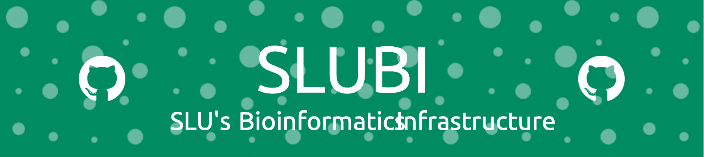

# What is this repository for?

This is a playground to try out different things that could make readme's easier to read, more informative, or just more fun. 

## Roadmap

- [x] Add a roadmap to the readme
- [ ] add a logo
- [ ] add an Octocat
- [ ] Github stats 
    - [ ] commits etc
    - [ ] coding languages

See the [open issues](https://github.com/amrei-bp/readme_playground/issues) for a full list of proposed features (and known issues).

(<a href="#readme-top">back to top</a>)

## 😎 Emojis

You can use emojis in the readme to clarify points (and even add them to commits, as I have just learned, use cases are to be determined). 

- ⏱ You can point out deadlines

- [📙](https://www.webfx.com/tools/emoji-cheat-sheet/) Link to documentation

- ✏ Or invite them to contribute

Here is a [cheat-sheet](https://www.webfx.com/tools/emoji-cheat-sheet/).

## Top contributors:

You can even add the top contributors of your repo to the readme: 

## License

Make it easy for others to know what they can do with your code and add license information into your readme. Often these are placed at the top of the readme for even easier accessibility. They link to the text of the license (not in your repository, but on the web). 

Here are some [markdown license badges](https://gist.github.com/lukas-h/2a5d00690736b4c3a7ba) you can use.

## Title banner

These you can use for projects, but also for your very own user readme. Easily generated [here](https://leviarista.github.io/github-profile-header-generator/). 

## Octocat

You can [design your very own octocat](https://myoctocat.com/), or (choose an existing one](https://octodex.github.com/),  and display it in your readme: 

## Skill icons

Advertise your skills by listing [skill icons](https://github.com/tandpfun/skill-icons):

  

